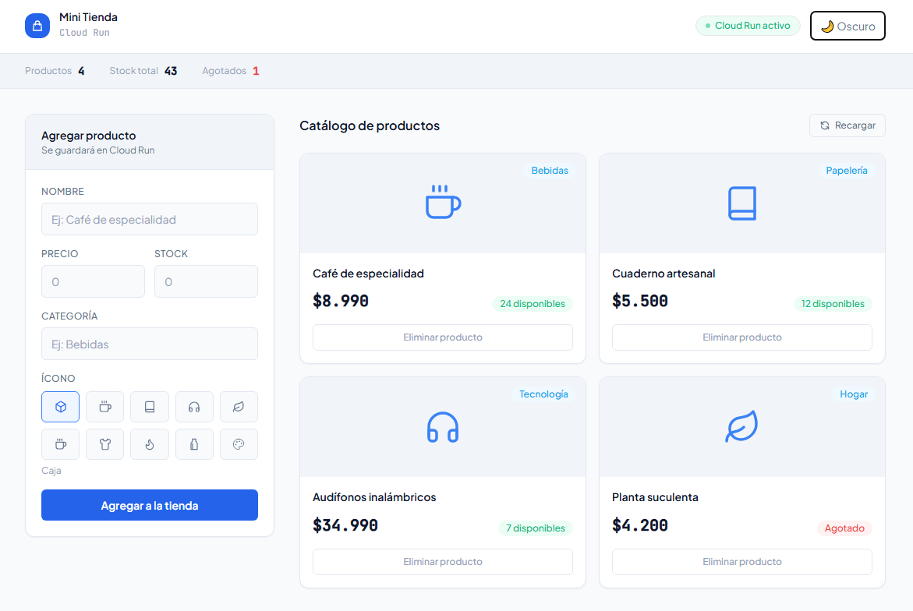
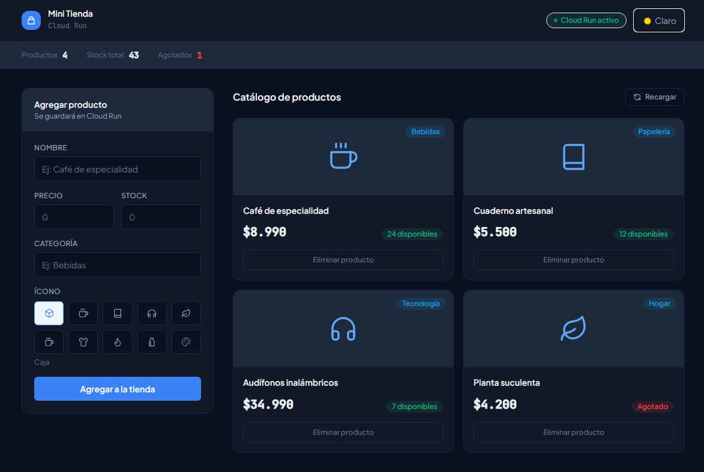
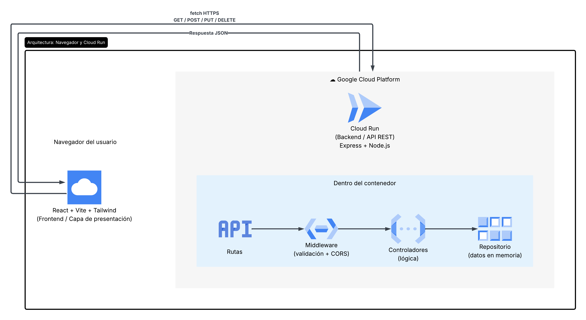
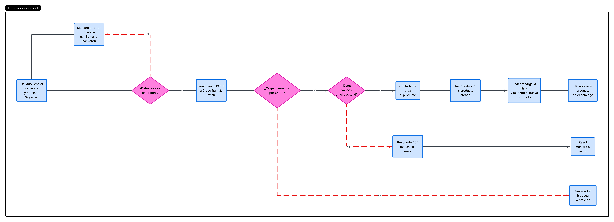
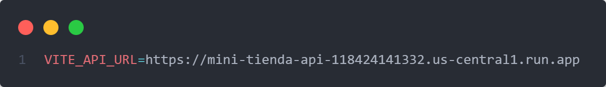
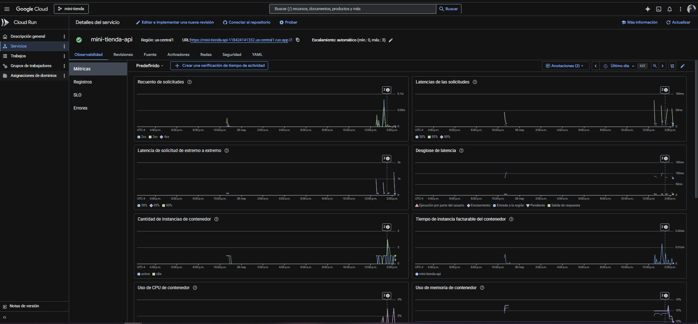
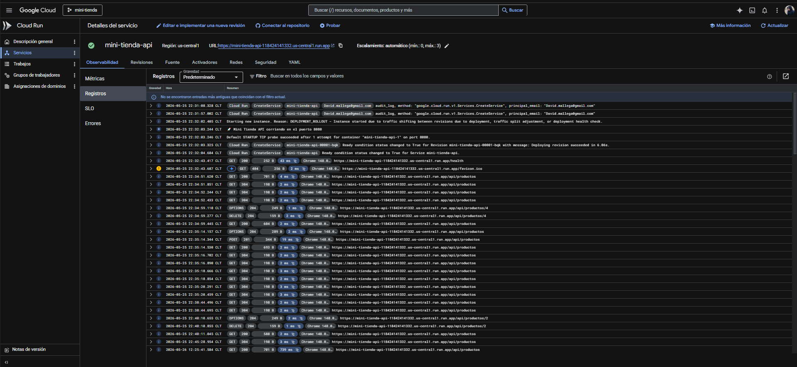

# 🛍️ Mini Tienda

Aplicación fullstack desplegada en producción. Frontend React que consume una API REST serverless en Google Cloud Run, con arquitectura en capas, doble validación y sistema de diseño propio.

**Demo en vivo:** https://mini-tienda-api-118424141332.us-central1.run.app/api/productos

---

## Vista previa

| Modo claro | Modo oscuro |
|-----------|------------|
|  |  |

---

## ¿Qué hace?

Catálogo de productos con operaciones CRUD completas: listar, crear y eliminar. El frontend nunca manipula los datos directamente — todo pasa por la API en Cloud Run. Incluye modo claro/oscuro, validación en cliente y servidor, y manejo de los cuatro estados de interfaz (cargando, vacío, error, con datos).

---

## Stack

| Capa | Tecnología |
|------|-----------|
| Frontend | React 18 · Vite · Tailwind CSS |
| Backend | Node.js 20 · Express (API REST) |
| Infraestructura | Google Cloud Run (serverless, contenedores) |
| Build del contenedor | Cloud Build + Dockerfile |

---

## Arquitectura del sistema

React hace peticiones `fetch()` a la URL del servicio en Cloud Run y recibe JSON de vuelta. La lógica del servidor está organizada en capas (rutas → middleware → controladores → repositorio de datos), cada una con una sola responsabilidad.



---

## Flujo de una operación (crear producto)

El sistema valida dos veces — en el cliente para dar feedback inmediato, y en el servidor porque nunca se confía en el cliente — y responde con códigos HTTP semánticos.



---

## Evidencia de despliegue

### Configuración de conexión

La variable de entorno `VITE_API_URL` apunta al servicio de Cloud Run. Es el único cambio entre entorno local y producción.



### Métricas del servicio

El servicio `mini-tienda-api` está activo en la región `us-central1`, con escalamiento automático de 0 a 3 instancias.



### Logs en producción

Los logs confirman el comportamiento esperado de la API en la nube:

- `GET 200 /api/productos` — el frontend solicitó el catálogo y la API respondió con éxito.
- `POST 201 /api/productos` — creación de un producto con código semántico correcto.
- `OPTIONS 204 → DELETE 204 /api/productos/4` — preflight de CORS funcionando correctamente.



> El par `OPTIONS 204 → DELETE 204` es el mecanismo de preflight de CORS. El navegador verifica permisos antes de ejecutar operaciones que modifican datos entre dominios distintos.

---

## Correr en local

**Backend**
```bash
cd backend
npm install
npm run dev          # http://localhost:8080
```

**Frontend**
```bash
cd frontend
npm install
npm run dev          # http://localhost:5173
```

---

## Despliegue en Cloud Run

```bash
cd backend
gcloud run deploy mini-tienda-api \
  --source . \
  --region us-central1 \
  --allow-unauthenticated
```

Empaqueta el código en un contenedor vía Cloud Build, lo sube a Google y entrega una URL pública HTTPS. El frontend se conecta mediante la variable de entorno `VITE_API_URL`.

---

## Endpoints de la API

| Método | Ruta | Acción | Código |
|--------|------|--------|--------|
| GET | `/api/productos` | Lista todos | 200 |
| GET | `/api/productos/:id` | Trae uno | 200 |
| POST | `/api/productos` | Crea | 201 |
| PUT | `/api/productos/:id` | Actualiza | 200 |
| DELETE | `/api/productos/:id` | Elimina | 204 |
| GET | `/health` | Health check | 200 |

---

## Decisiones técnicas

- **Separación en capas**: cambiar de datos en memoria a una base de datos real solo afectaría el repositorio.
- **Doble validación** (cliente + servidor): buena experiencia de usuario y seguridad real.
- **CORS explícito** con lista de orígenes permitidos, verificado en logs de producción.
- **Códigos HTTP semánticos**: 200, 201, 204, 400, 404, 500.
- **Sistema de diseño propio**: tech/SaaS con modo claro/oscuro.
- **Variables de entorno** para la URL de la API: nada hardcodeado.
