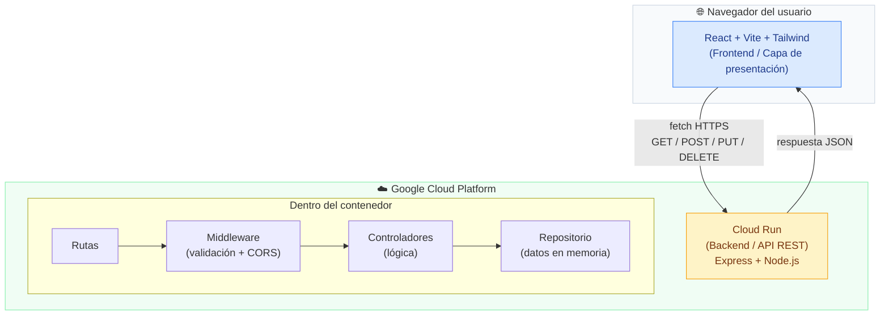

# Diagrama de Arquitectura del Sistema

Este diagrama muestra las **cajas** del sistema y cómo se conectan entre sí. Responde a la pregunta: *"¿de qué piezas está hecho mi sistema y quién habla con quién?"*

## Cómo leer la sintaxis de Mermaid (arquitectura)

Aprende estos elementos y podrás dibujar cualquier arquitectura:

**`graph TB`** — declara un diagrama de grafo. `TB` = *Top to Bottom* (de arriba a abajo). También existe `LR` (*Left to Right*, izquierda a derecha).

**`subgraph nombre["Título"] ... end`** — agrupa cajas dentro de un contenedor. Lo usamos para mostrar qué corre en el navegador y qué corre en GCP.

**`Nodo["Texto"]`** — define una caja. El texto entre corchetes es lo que se ve. El ` ` hace salto de línea dentro de la caja.

**`A -->|"etiqueta"| B`** — una flecha de A hacia B con una etiqueta encima. Aquí muestra que React envía peticiones a Cloud Run y este devuelve JSON.

**`A --> B`** — flecha simple sin etiqueta.

**`style Nodo fill:#color,stroke:#color,color:#color`** — da color a una caja: `fill` es el fondo, `stroke` el borde, `color` el texto.

## Qué dice este diagrama

El frontend vive en el navegador del usuario; no sabe nada de cómo funciona el backend por dentro. Solo le manda peticiones HTTPS y recibe JSON. Toda la lógica vive en Cloud Run, organizada en capas (rutas → middleware → controladores → datos). Esa separación en capas es lo que hace el código mantenible: cada pieza tiene una sola responsabilidad.
