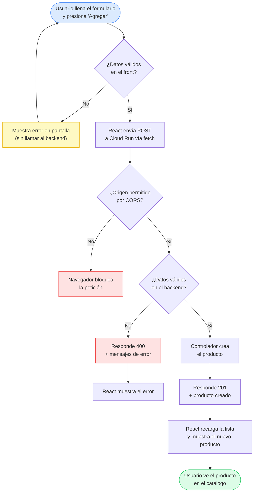

# Flujo del Sistema — Crear producto

Muestra el recorrido completo desde que el usuario envía el formulario hasta que ve el resultado en el catálogo.

## Diagrama

```mermaid
flowchart TD
    Inicio(["Usuario llena el formulario<br/>y presiona 'Agregar'"]) --> ValidaFront{"¿Datos válidos<br/>en el front?"}

    ValidaFront -->|No| ErrorFront["Muestra error en pantalla<br/>(sin llamar al backend)"]
    ErrorFront --> Inicio

    ValidaFront -->|Sí| Fetch["React envía POST<br/>a Cloud Run vía fetch"]

    Fetch --> CORS{"¿Origen permitido<br/>por CORS?"}
    CORS -->|No| ErrorCORS["Navegador bloquea<br/>la petición"]

    CORS -->|Sí| ValidaBack{"¿Datos válidos<br/>en el backend?"}
    ValidaBack -->|No| Error400["Responde 400<br/>+ mensajes de error"]
    Error400 --> MuestraError["React muestra el error"]

    ValidaBack -->|Sí| Crea["Controlador crea<br/>el producto"]
    Crea --> Responde201["Responde 201<br/>+ producto creado"]
    Responde201 --> Recarga["React recarga la lista<br/>y muestra el nuevo producto"]
    Recarga --> Fin(["Usuario ve el producto<br/>en el catálogo"])

    style Inicio fill:#dbeafe,stroke:#3b82f6
    style Fin fill:#dcfce7,stroke:#22c55e
    style Error400 fill:#fee2e2,stroke:#ef4444
    style ErrorCORS fill:#fee2e2,stroke:#ef4444
    style ErrorFront fill:#fef9c3,stroke:#eab308
```
